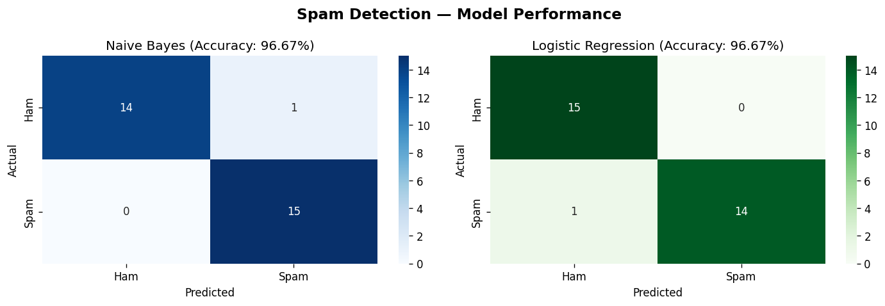
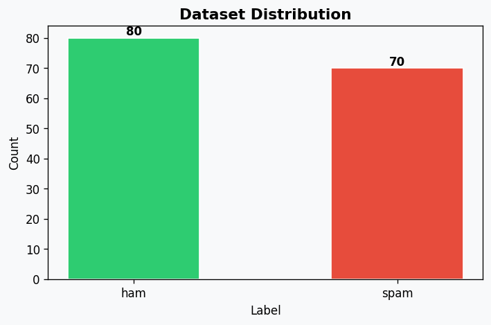

# 📧 Spam Detection Using NLP

A machine learning project to classify SMS messages as **Spam** or **Ham (Not Spam)** using Natural Language Processing (NLP) techniques.

---

## 🔍 Project Overview

This project builds a spam detector using:
- **TF-IDF Vectorization** to convert text into numbers
- **Naive Bayes** classifier (best for text classification)
- **Logistic Regression** classifier (for comparison)

Both models achieved **96.67% accuracy** on the test set.

---

## 📁 Project Structure

```
spam-detection/
│
├── spam_detector.py       # Main project code
├── spam_dataset.csv       # Dataset (ham and spam messages)
├── confusion_matrix.png   # Model performance visualization
├── distribution.png       # Dataset distribution chart
└── README.md              # Project documentation
```

---

## 🛠️ Tech Stack

| Tool | Purpose |
|------|---------|
| Python | Core programming language |
| Pandas | Data loading and manipulation |
| Scikit-learn | ML models and TF-IDF |
| Matplotlib & Seaborn | Data visualization |
| Regex (re) | Text cleaning |

---

## ⚙️ How It Works

1. **Load Dataset** — CSV with spam and ham messages
2. **Clean Text** — Lowercase, remove special characters
3. **TF-IDF Vectorization** — Convert text to numerical features
4. **Train Models** — Naive Bayes + Logistic Regression
5. **Evaluate** — Accuracy, Precision, Recall, F1-Score
6. **Predict** — Test with your own custom messages

---

## 📊 Results

| Model | Accuracy |
|-------|----------|
| Naive Bayes | 96.67% |
| Logistic Regression | 96.67% |

---

## 🖼️ Visualizations

### Confusion Matrix


### Dataset Distribution


---

## 🚀 How to Run

```bash
# 1. Clone the repository
git clone https://github.com/shadowsming/spam-detection.git
cd spam-detection

# 2. Install dependencies
pip install pandas scikit-learn matplotlib seaborn

# 3. Run the project
python spam_detector.py
```

---

## 🧪 Test With Your Own Messages

The project lets you test any message at the bottom of `spam_detector.py`:

```python
predict_spam("You have won a free iPhone! Click here now")
# Output: 🚨 SPAM

predict_spam("Hey, are you coming to dinner tonight?")
# Output: ✅ HAM (Not Spam)
```

---

## 👤 Author

**Faiz Ahmed Khan**
- GitHub: [github.com/shadowsming](https://github.com/shadowsming)
- LinkedIn: [linkedin.com/in/faiz-khan-40553026b](https://linkedin.com/in/faiz-khan-40553026b)
- Email: khanfaiz0119@gmail.com

---

## 📚 What I Learned

- How to clean and preprocess text data using NLP
- How TF-IDF converts text into machine-readable numbers
- How Naive Bayes and Logistic Regression work for classification
- How to evaluate ML models using classification reports and confusion matrices

---

⭐ **If you found this project helpful, give it a star!**
